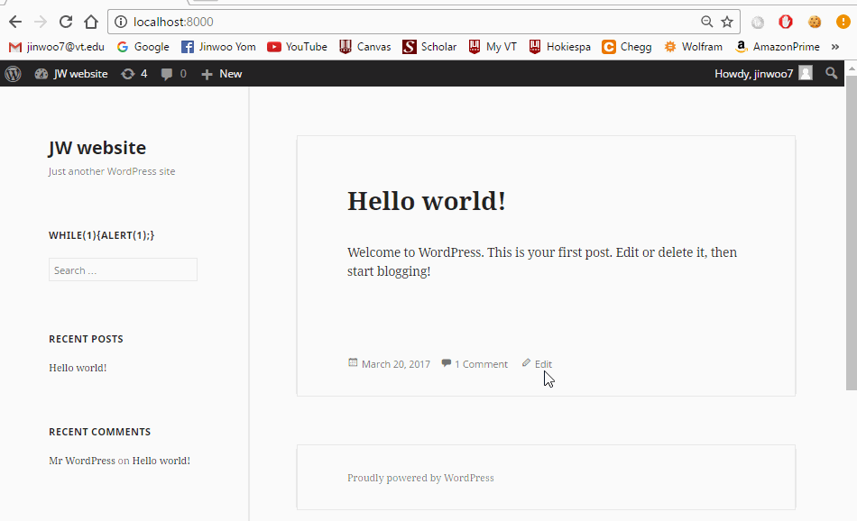

# Project 7 - WordPress Pentesting

Time spent: **4** hours spent in total

> Objective: Find, analyze, recreate, and document **five vulnerabilities** affecting an old version of WordPress

## Pentesting Report

1. (Required) WordPress <= 4.1.1 - Unauthenticated Stored Cross-Site Scripting (XSS)
  - [x] Summary: 
    - Vulnerability types: XSS Injection
    - Tested in version: Wordpress 4.1.1
    - Fixed in version: Wordpress 4.1.2
  - [x] GIF Walkthrough: 
  
  - [x] Steps to recreate: 
  1st step..
  Log into Wordpress 4.1.1 version's website.
  
  2nd step..
  Comment on a post (Inject a following script below)
  
  3rd step..
  Press submit. The page will refresh and you will recieve endless alert messages.
  
2. (Required) WordPress  4.0-4.7.2 - Authenticated Stored Cross-Site Scripting (XSS) in YouTube URL Embeds
  - [x] Summary: 
    - Vulnerability types: XSS Injection
    - Tested in version: 4.1.1
    - Fixed in version: 4.2.13
  - [x] GIF Walkthrough: 
  
  - [x] Steps to recreate: 
  1st step..
  Log into Wordpress 4.1.1 version's website.
  
  2nd step..
  Comment on a post (Inject a following script below)
  
  3rd step..
  Press update. The page will refresh and you will recieve endless alert messages.
  - [x] Affected source code:
    - [Link 1](https://github.com/WordPress/WordPress/commit/419c8d97ce8df7d5004ee0b566bc5e095f0a6ca8)
    
3. (Required) WordPress 3.6.0-4.7.2 - Authenticated Cross-Site Scripting (XSS) via Media File Metadata
  - [X] Summary: 
    - Vulnerability types: XSS Injection
    - Tested in version: 4.2.1
    - Fixed in version: 4.2.13
  - [X] GIF Walkthrough: 
  
  - [x] Steps to recreate: 
  1st step..
  Log into Wordpress 4.1.1 version's website.
  
  2nd step..
  Go to the dashboard menu by hovering over the website name on the top left and clicking Dashboard.
  
  3rd step..
  Click Media on the side panel. Drag and drop the modified mp3 file (xss.mp3) to upload it multiple times.
  
  4th step..
  Click Posts on the side panel. Either Create a new post or edit an existing post.
  
  5th step..
  click Add Media -> Create Audio Playlist. Select all of the uploaded xss.mp3 files. Notice that the modifications are shown on the description of the file.
  6th step..
  Press Create a new playlist. The page will refresh and you will recieve alert messages.
  
  - [x] Affected source code:
    - [Link 1](https://github.com/WordPress/WordPress/commit/28f838ca3ee205b6f39cd2bf23eb4e5f52796bd7)

## Assets

The xss.mp3 file from the 3rd vulnerability explot can be found in xssInjection3 directory in this git repository. 

## Resources

- [WordPress Source Browser](https://core.trac.wordpress.org/browser/)
- [WordPress Developer Reference](https://developer.wordpress.org/reference/)

GIFs created with [LiceCap](http://www.cockos.com/licecap/).

## Notes

Describe any challenges encountered while doing the work

## License

    Copyright [2017] [Jinwoo Yom]

    Licensed under the Apache License, Version 2.0 (the "License");
    you may not use this file except in compliance with the License.
    You may obtain a copy of the License at

        http://www.apache.org/licenses/LICENSE-2.0

    Unless required by applicable law or agreed to in writing, software
    distributed under the License is distributed on an "AS IS" BASIS,
    WITHOUT WARRANTIES OR CONDITIONS OF ANY KIND, either express or implied.
    See the License for the specific language governing permissions and
    limitations under the License.